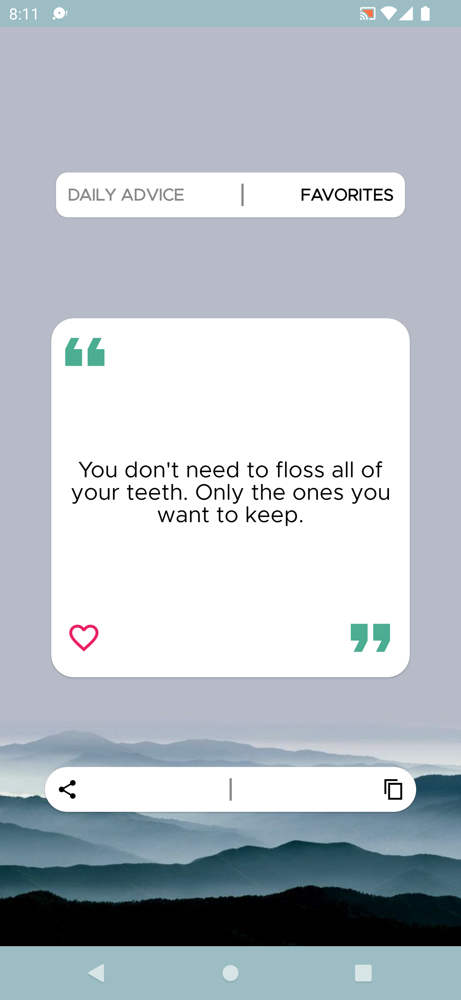
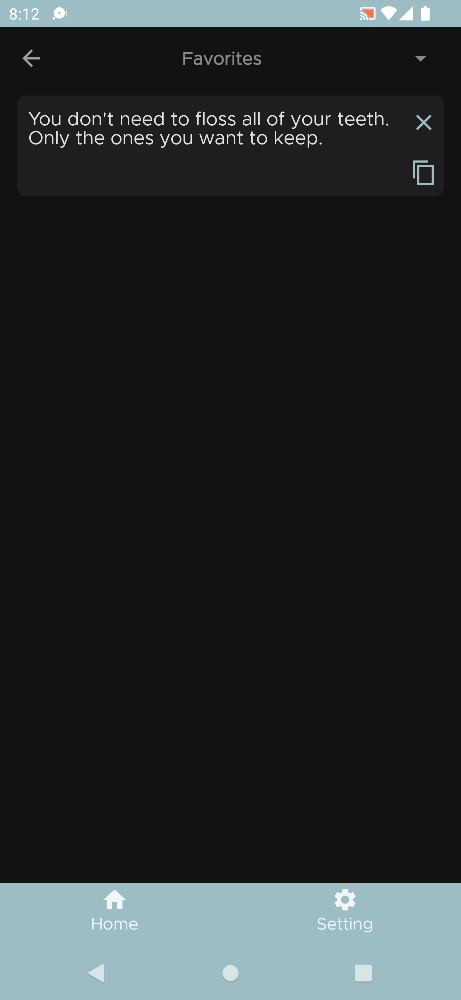
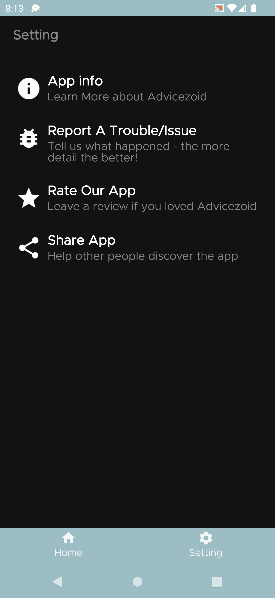
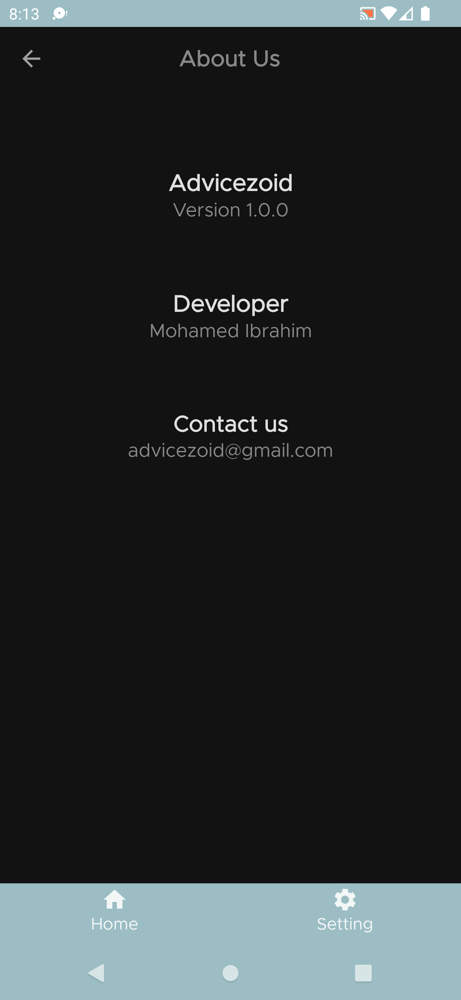
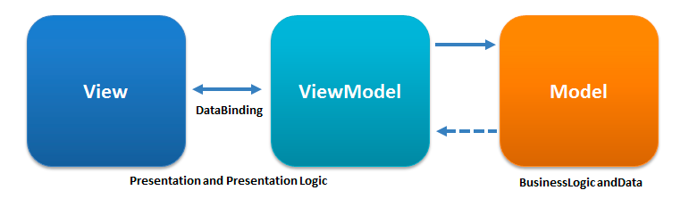

# 🔖 AdviceZoid
An Advice Application built to Demonstrate the use of Jetpack Compose for building declarative UI in
Android. *Made with love ❤️ by [Mohamed Ibrahim](https://github.com/moemaair)*

The final app looks like this:



## Built With 🛠

- [Kotlin](https://kotlinlang.org/) - First class and official programming language for Android
  development.
- [Jetpack Compose](https://developer.android.com/jetpack/compose) - Jetpack Compose is Android’s
  modern toolkit for building native UI.
- [Coroutines](https://kotlinlang.org/docs/reference/coroutines-overview.html) - A coroutine is a
  concurrency design pattern that you can use on Android to simplify code that executes
  asynchronously.
- [Android Architecture Components](https://developer.android.com/topic/libraries/architecture) -
  Collection of libraries that help you design robust, testable, and maintainable apps.
    - [ViewModel](https://developer.android.com/topic/libraries/architecture/viewmodel) - Stores
      UI-related data that isn"t destroyed on UI changes.
    - [Jetpack Compose Navigation](https://developer.android.com/jetpack/compose/navigation) - The
      Navigation component provides support for Jetpack Compose applications.
- [Material Components for Android](https://github.com/material-components/material-components-android)
    - Modular and customizable Material Design UI components for Android.
- [Realm by MongoDB](https://realm.io/)
    - Realm is a fast, scalable alternative to SQLite with mobile to cloud data sync that makes building real-time, reactive mobile apps easy.
- [Figma](https://figma.com/) - Figma is a vector graphics editor and prototyping tool which is
  primarily web-based.

## Architecture 🗼

This app uses [***MVVM (Model View
View-Model)***](https://developer.android.com/jetpack/docs/guide#recommended-app-arch) architecture.



## Contact 📩

Have an project? DM us at 👇

Drop a mail to:- ibrahimohamed81@outlook.com

## Donation 💰

If this project help you reduce time to develop, you can give me a cup of coffee :)

<a href="https://www.buymeacoffee.com/mohamedIbrahim8" target="_blank"></a>

<br>

## Credits 🤗

- 🤓 Fonts are from [Google fonts](https://fonts.google.com/knowledge)

<br />

## License 🔖

```
MIT License

Copyright (c) 2022 Mohamed Ibrahim

Permission is hereby granted, free of charge, to any person obtaining a copy
of this software and associated documentation files (the "Software"), to deal
in the Software without restriction, including without limitation the rights
to use, copy, modify, merge, publish, distribute, sublicense, and/or sell
copies of the Software, and to permit persons to whom the Software is
furnished to do so, subject to the following conditions:

The above copyright notice and this permission notice shall be included in all
copies or substantial portions of the Software.

THE SOFTWARE IS PROVIDED "AS IS", WITHOUT WARRANTY OF ANY KIND, EXPRESS OR
IMPLIED, INCLUDING BUT NOT LIMITED TO THE WARRANTIES OF MERCHANTABILITY,
FITNESS FOR A PARTICULAR PURPOSE AND NONINFRINGEMENT. IN NO EVENT SHALL THE
AUTHORS OR COPYRIGHT HOLDERS BE LIABLE FOR ANY CLAIM, DAMAGES OR OTHER
LIABILITY, WHETHER IN AN ACTION OF CONTRACT, TORT OR OTHERWISE, ARISING FROM,
OUT OF OR IN CONNECTION WITH THE SOFTWARE OR THE USE OR OTHER DEALINGS IN THE
SOFTWARE.
```